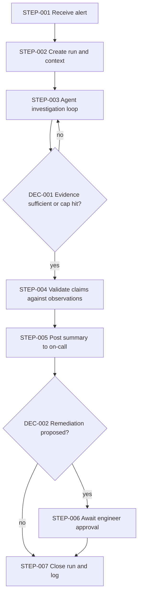

# Workflow Architecture: Incident investigation assistant

> Illustrative example (invented scenario) · Depth: **Standard** · Demonstrates: an agent that is actually justified, a least-privilege permission model, hard stop conditions, and a human gate in front of anything that changes a system.

## Business Objective

**BO-001** — When an alert fires, the on-call engineer receives a summary of likely causes with supporting evidence within minutes, so diagnosis starts from facts instead of from scratch. `[STATED]`

## Requirements

| ID | Description | Source | Priority | Acceptance criteria |
|---|---|---|---|---|
| WR-001 | Investigate an alert by consulting several read-only sources (logs, metrics, recent deploys) whose relevance depends on what earlier lookups reveal | `[STATED]` | Must | Report cites the evidence for each suggested cause |
| WR-002 | The assistant cannot change any system; remediation is only suggested | `[RECOMMENDED]` | Must | Credentials used are read-only; verified in a permission test |
| WR-003 | Any proposed remediation requires an engineer's explicit approval before a separate, existing runbook executes it | `[RECOMMENDED]` | Must | No remediation path exists without an approval record |
| WR-004 | An investigation always ends within fixed time and cost limits | `[RECOMMENDED]` | Must | Runs terminate at the cap in a forced-loop test |
| WR-005 | Each investigation is auditable step by step | `[INFERRED]` | Should | Every tool call and observation is retrievable by alert ID |

## Assumptions

| ID | Assumption | Impact if wrong |
|---|---|---|
| A-001 | Log, metric and deploy systems expose read-only query APIs `[ASSUMED]` | `REQUIRES VALIDATION`; missing sources reduce coverage, not architecture |
| A-002 | Typical investigation needs fewer than 15 tool calls `[ASSUMED]` | Caps in STEP-003 must be tuned |

## Trigger Architecture

Source: alerting system webhook. Payload: alert ID, service, severity, start time. Authentication: signed webhook. Duplicate behavior: one investigation per alert ID; repeats attach to the existing run. Volume: `UNKNOWN`. Failure behavior: if the investigation cannot start, the original alert still reaches the engineer unchanged — the assistant is additive.

## Agent Architecture

**Justification.** WR-001 requires choosing which source to query next based on findings. A fixed pipeline querying everything would be slow, noisy and exceed context limits; a rules tree cannot anticipate novel failures. A single agent is enough: sources are few and share one context, so multi-agent is **not** justified.

- **Goal:** produce an evidence-backed summary of likely causes for one alert.
- **Tools:** TOOL-001 log search, TOOL-002 metric query, TOOL-003 recent-deploys list — all read-only.
- **Permissions (least privilege):** read access scoped to the alerting service and its direct dependencies; no write scopes anywhere. Restricted: any change, restart, rollback, ticket closure. Approval required for: nothing the agent can execute (it can only propose).
- **Planning/memory:** short plan, then step-by-step; working notes kept for this run only; no long-term memory.
- **Validation:** every claimed cause must reference at least one retrieved observation; unreferenced claims are dropped by a deterministic check.
- **Stop conditions:** max 15 tool calls, 5 minutes, token budget (value to tune per A-002), or evidence judged sufficient. Repeated identical calls end the run.
- **Failure conditions:** if the cap is hit or sources are unavailable, report what was checked and what was not, then hand to the engineer. The agent never loops to "try harder".

Tool output (log lines, deploy messages) is untrusted text and may contain instructions; it is treated as data.

## Tool Architecture

| Tool ID | Name | Purpose | Auth / permission | Failure mode | Side effects |
|---|---|---|---|---|---|
| TOOL-001 | Log search | Query recent logs for a service | Read-only token, service-scoped | Timeout, truncated results | None |
| TOOL-002 | Metric query | Fetch metric series | Read-only token | Timeout, empty series | None |
| TOOL-003 | Recent deploys | List recent changes | Read-only token | Stale data | None |

## Workflow Architecture

| Step ID | Name | Type | Failure | Retry | Timeout |
|---|---|---|---|---|---|
| STEP-001 | Receive alert | Trigger | Reject unsigned requests | N/A — sender retries | 10 s |
| STEP-002 | Create run and context | Database operation | If it fails, skip assistant; the alert already reached the engineer | 3 attempts, backoff | 5 s |
| STEP-003 | Agent investigation loop | Agent | Tool error → note it and try another source; caps → report partial | Per-tool: 2 retries on transient errors with jitter | 5 min overall, 30 s per tool call |
| STEP-004 | Validate claims | Validation | Unsupported claims removed; if nothing remains, say "no supported cause found" | N/A (pure logic) | 5 s |
| STEP-005 | Post summary | Notification | Fall back to a second channel and alert | 5 attempts; posting keyed by run ID so a retry does not duplicate | 10 s |
| STEP-006 | Await engineer approval | Human approval | No answer within the window → do nothing and re-notify once | One re-notification after 15 min | 30 min, then escalate to secondary on-call |
| STEP-007 | Close run and log | Storage | Buffer and retry; non-blocking | 5 attempts | 5 s |

**DEC-001** — Evidence sufficient or cap hit? Method: the agent's own judgment **plus** hard caps enforced outside the model.

**DEC-002** — Remediation proposed? Method: rule (summary contains a remediation proposal field). Approved remediation executes via an existing, separately controlled runbook, not through this workflow.

## Error Handling

Every degraded path ends with the engineer receiving *something*: the original alert, a partial report, or "no supported cause found". Duplicate alert deliveries attach to the existing run, so retries cannot start parallel investigations. The approval step has a timeout and a default-safe outcome (no action).

## Security

Read-only credentials from a secret manager, scoped per service; the agent runtime has no network egress except the three tool endpoints. Prompt injection via log content is the main AI-specific threat: mitigated structurally, since the agent has no write capability and its output cannot trigger actions without approval (WR-002, WR-003). Audit log of tool calls is append-only.

## Observability

Correlation ID = alert ID. Metrics: investigations started/completed/capped, tool calls per run, time to summary, token cost per run, share of summaries with at least one supported cause, engineer feedback (useful / not useful). Alerts: assistant silent while alerts fire; cap-hit rate rising.

## Risks

| ID | Risk | Likelihood | Severity | Mitigation |
|---|---|---|---|---|
| WRISK-001 | Plausible but wrong cause misleads the engineer | `UNKNOWN` | Medium | Evidence citations, claim validation (STEP-004), feedback metric |
| WRISK-002 | Costs grow with alert volume or noisy alerts | `UNKNOWN` | Low | Per-run cost cap, dedupe by alert ID |
| WRISK-003 | Injected instruction in log text steers the agent | Medium | Low | Read-only tools, no actions available |

## Implementation Blueprint

| Task | Component | Objective | Depends on | Acceptance criteria |
|---|---|---|---|---|
| TASK-001 | Intake and run store (STEP-001, STEP-002) | One run per alert ID | — | Duplicate alert attaches to existing run |
| TASK-002 | Tool adapters (TOOL-001, TOOL-002, TOOL-003) | Read-only wrappers with timeouts and redaction | — | Permission test confirms no write possible (WR-002) |
| TASK-003 | Agent loop with caps (STEP-003, DEC-001) | Bounded investigation | TASK-002 | Forced-loop test ends at cap (WR-004) |
| TASK-004 | Validation and posting (STEP-004, STEP-005) | Supported claims only, idempotent post | TASK-003 | Unsupported claim removed in test (WR-001) |
| TASK-005 | Approval gate and audit (STEP-006, STEP-007, DEC-002) | Approval record, escalation, audit trail | TASK-004 | No remediation path without approval (WR-003, WR-005) |

## Open Questions

| ID | Question | Why it matters |
|---|---|---|
| Q-001 | Which alert types are in scope first? | Limits tools and the evaluation set |
| Q-002 | Who is secondary on-call and what is the escalation window? | Sets the STEP-006 timeout path |
| Q-003 | Are there data-handling limits on sending log excerpts to a model provider? | May require redaction rules or a different hosting choice (`REQUIRES VALIDATION`) |
