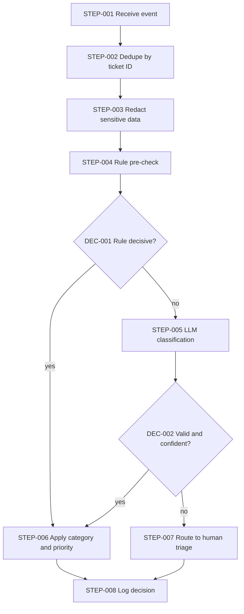

# Workflow Architecture: Support-ticket triage

> Illustrative example (invented scenario) · Depth: **Standard** · Demonstrates: a single LLM step inside a fixed pipeline (rung 2), with schema validation, a low-confidence path and fallbacks. No agent.

## Business Objective

**BO-001** — New support tickets reach the right queue with a priority within minutes, without a person reading every ticket first. `[STATED]`

## Requirements

| ID | Description | Source | Priority | Acceptance criteria |
|---|---|---|---|---|
| WR-001 | Each new ticket is assigned one category from a fixed list and a priority | `[STATED]` | Must | Every processed ticket has both fields set |
| WR-002 | Tickets the system is unsure about go to a human triager | `[RECOMMENDED]` | Must | Items labeled `review` appear in the triage queue |
| WR-003 | The same ticket is never triaged or notified twice | `[INFERRED]` from at-least-once delivery | Must | Replaying an event produces no second assignment |
| WR-004 | Customer text is not sent to the model with payment card numbers or credentials | `[RECOMMENDED]` | Must | Redaction step output contains none in test set |
| WR-005 | Triage accuracy is measured and tracked | `[RECOMMENDED]` | Should | Weekly accuracy figure against a labeled sample; target not defined (see Q-001) |

## Assumptions

| ID | Assumption | Impact if wrong |
|---|---|---|
| A-001 | The helpdesk can emit a "ticket created" webhook and accept category/priority updates via API `[ASSUMED]` | `REQUIRES VALIDATION`; otherwise STEP-001 becomes polling |
| A-002 | Category list is small and stable (under ten) `[ASSUMED]` | A larger or changing taxonomy raises prompt and evaluation cost |

## Trigger Architecture

Source: helpdesk "ticket created" event. Payload: ticket ID, subject, body, requester ID. Authentication: shared-secret signature verified before processing. Validation: required fields and size limit. Expected volume: `UNKNOWN`. Duplicate behavior: ticket ID is the idempotency key (WR-003). Failure behavior: unauthenticated or malformed events rejected and logged.

## Workflow Architecture

**DEC-001** — Rule decisive? Method: keyword/field rules (for example, a known outage banner). Output: category or "undecided". Fallback: LLM step.

**DEC-002** — Valid and confident? Method: deterministic schema check plus agreement between rule hint and model label; a model-reported score alone is not trusted. Output: accept / review. Fallback: human triage.

| Step ID | Name | Type | Failure | Retry | Timeout |
|---|---|---|---|---|---|
| STEP-001 | Receive event | Trigger | Reject bad signature (4xx) | N/A — sender retries | 10 s |
| STEP-002 | Dedupe by ticket ID | Database operation | If store unavailable, fail closed and let sender retry | 3 attempts, backoff | 2 s |
| STEP-003 | Redact sensitive data | Function | On error, skip model path and send to human triage | N/A (pure logic) | 2 s |
| STEP-004 | Rule pre-check | Condition | Treat as "undecided" | N/A | 1 s |
| STEP-005 | LLM classification | AI call | Invalid/empty output → one repair retry, then STEP-007 | 1 repair retry; 2 retries on transient API error with jitter | 20 s |
| STEP-006 | Apply category and priority | API call (helpdesk) | Park in failure table, alert | 3 attempts; update is an idempotent set-field call | 10 s |
| STEP-007 | Route to human triage | Human approval | If queue write fails, alert; ticket stays untriaged but visible | 3 attempts | 10 s |
| STEP-008 | Log decision | Storage | Non-blocking; buffer and retry | 5 attempts | 5 s |

**AI step (STEP-005).** Model class: small/fast general model, chosen by measured accuracy on a labeled sample, not by popularity (`REQUIRES VALIDATION`). Prompt purpose: classify into the fixed list and priority. Output schema: `{category: enum, priority: enum, reason: string ≤ 200 chars}`. Validation: enum membership and non-empty reason. The ticket text is untrusted: the model has no tools and its output can only set two fields, which limits what an injected instruction can do.

## Error Handling

Per-step failure and retry rules are in the step table. Principle: a failure anywhere in the AI path degrades to **human triage**, never to a silent drop and never to a guess. Items that exhaust retries on STEP-006 land in a failure table for a named owner. Duplicate events stop at STEP-002, so retries cannot double-apply updates.

## Security

Verify webhook signature; store the helpdesk API token and model key in a secret manager with least-privilege scopes (set category/priority only). Redact card numbers and credentials before the model call (WR-004). Treat ticket content as untrusted (prompt injection): no tool access for the model, output constrained to an enum schema. Log ticket IDs and decisions, not full ticket bodies.

## Observability

Correlation ID = ticket ID. Metrics: tickets processed, route-to-human rate, schema-failure rate, per-step latency, token usage and cost per ticket. Alerts: webhook silence beyond the expected window, failure-table growth, sudden jump in human-triage rate (may signal model or prompt problems).

## Risks

| ID | Risk | Likelihood | Severity | Mitigation |
|---|---|---|---|---|
| WRISK-001 | Misclassification routes an urgent ticket to a low-priority queue | `UNKNOWN` | High | Rule overrides for known urgent signals; human triage for low agreement; weekly accuracy sample (WR-005) |
| WRISK-002 | Prompt injection in ticket text tries to change priority | Medium | Medium | No tools, enum-only output, deterministic validation |

## Implementation Blueprint

| Task | Component | Objective | Depends on | Acceptance criteria |
|---|---|---|---|---|
| TASK-001 | Webhook receiver (STEP-001, STEP-002) | Verified, deduplicated intake | — | Replayed event creates no second record (WR-003) |
| TASK-002 | Redaction (STEP-003) | Remove sensitive patterns | TASK-001 | Test set shows none reach the model (WR-004) |
| TASK-003 | Classification step (STEP-004, STEP-005, DEC-001, DEC-002) | Rule pre-check, LLM call, validation | TASK-002 | Meets accuracy target once defined (WR-001, WR-002, WR-005) |
| TASK-004 | Helpdesk update and human routing (STEP-006, STEP-007) | Apply result or route to triager | TASK-003 | Fields set or ticket visible in triage queue (WR-001, WR-002) |
| TASK-005 | Logging and metrics (STEP-008) | Observability above | TASK-001 | Dashboard shows listed metrics |

## Traceability

| WR | STEP | TASK |
|---|---|---|
| WR-001 | STEP-005, STEP-006 | TASK-003, TASK-004 |
| WR-002 | STEP-007, DEC-002 | TASK-003, TASK-004 |
| WR-003 | STEP-002 | TASK-001 |
| WR-004 | STEP-003 | TASK-002 |
| WR-005 | STEP-008 | TASK-003, TASK-005 |

## Open Questions

| ID | Question | Why it matters |
|---|---|---|
| Q-001 | What accuracy and human-triage rate are acceptable? | Sets the target for WR-005 and the confidence rule in DEC-002 |
| Q-002 | Expected tickets per day and peak? | Drives model cost and whether queueing is needed |
