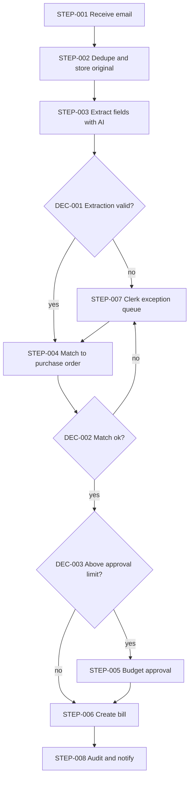
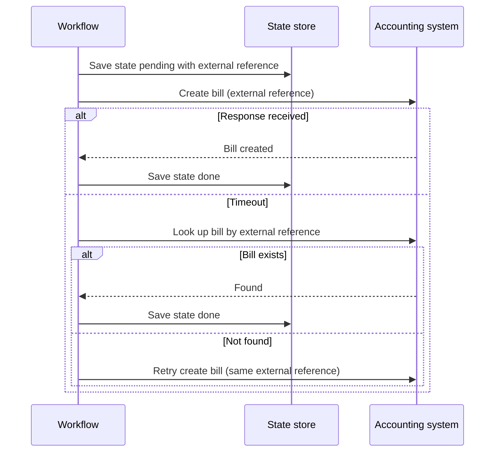

# Workflow Architecture: Supplier invoice processing

> Illustrative example (invented scenario) · Depth: **Full** · Demonstrates: the complete package — drivers, quality attributes, alternatives with trade-offs, a selected architecture, ADRs, labeled cost, tests and traceability — for a business-process automation that uses AI only where it earns its place.

## Executive Summary

Invoices arrive by email as PDFs and are keyed in by hand. The recommended design (Option B) extracts fields with a single AI step, then applies deterministic matching and approval rules; people review only exceptions. No agent is used.

## Business Objective

**BO-001** — Supplier invoices are captured accurately and routed for payment approval with less manual keying, while no invoice is paid twice or without the required approval. `[STATED]`

## Actors

| Actor | Role |
|---|---|
| Accounts-payable clerk | Reviews exceptions `[STATED]` |
| Budget approver | Approves invoices above their limit `[ASSUMED]` |
| Supplier | Sends invoices by email `[STATED]` |
| Accounting system | System of record for payment (name `NOT PROVIDED`) |

## Constraints

Invoices contain business-sensitive data; the accounting system's API capabilities are `REQUIRES VALIDATION`; timeline and budget are `NOT PROVIDED`.

## Assumptions

| ID | Assumption | Impact if wrong |
|---|---|---|
| A-001 | Purchase orders exist in the accounting system and can be queried by number `[ASSUMED]` | Without them, matching rules (DEC-002) must be reduced to supplier and amount checks |
| A-002 | About 400 invoices per month, 10% non-PDF or scanned `[ASSUMED]` | Drives cost estimate; scanned documents need an extraction fallback |
| A-003 | The accounting system exposes an API for creating bills with an external reference `[ASSUMED]` | `REQUIRES VALIDATION`; otherwise the final step becomes a controlled file import |

## Requirements

| ID | Description | Source | Priority | Acceptance criteria |
|---|---|---|---|---|
| WR-001 | Extract supplier, invoice number, date, totals and line items from each invoice | `[STATED]` | Must | Field accuracy on a labeled sample meets the target in Q-001 |
| WR-002 | Match each invoice to a purchase order and flag mismatches | `[STATED]` | Must | Mismatch test set is flagged with the reason |
| WR-003 | The same invoice is never entered twice | `[INFERRED]` | Must | Duplicate email and re-sent invoice both produce one bill |
| WR-004 | Invoices above a limit need budget-approver approval before entry | `[STATED]` | Must | No bill above the limit exists without an approval record |
| WR-005 | Extraction output is validated before use; failures go to a clerk | `[RECOMMENDED]` | Must | Invalid or low-agreement results appear in the exception queue |
| WR-006 | Every decision and change is auditable | `[INFERRED]` | Should | Audit entry for extraction, match, approval and entry |

## Workflow Drivers

| ID | Driver | Why it matters | Options it eliminates |
|---|---|---|---|
| WD-001 | Financial correctness (no duplicate or unapproved payments) | Money leaves the company | Fully automatic entry without validation or approval |
| WD-002 | Auditability | Finance controls | Designs where decisions are not recorded |
| WD-003 | Varied unstructured input (PDF layouts differ by supplier) | Rules-only extraction is brittle | Pure template/rule extraction |
| WD-004 | Modest volume (A-002) | Low throughput | Queue clusters, complex orchestration |

## Quality Attributes

Reliability and determinism (matching and approval are rule-based); auditability (WD-002); security (sensitive financial data); cost efficiency (token cost per invoice, section Cost); explainability (extraction shows source text per field). Performance target: **not defined** — same-day processing assumed acceptable `[ASSUMED]`.

## Trigger Architecture

Source: email received in the shared AP mailbox. Payload: message with attachment(s). Authentication: mailbox access via delegated, read-only credentials. Validation: allowed file types and size limit; non-invoice mail ignored. Volume: see A-002. Duplicate behavior: message ID plus content hash (WR-003). Failure behavior: unreadable attachments go to the clerk queue.

## Alternatives

| | Option A — Deterministic | Option B — AI extraction + rules | Option C — Agentic |
|---|---|---|---|
| Architecture | Templates and OCR rules per supplier | One AI extraction step, then rule-based match and approval | Agent decides how to read, look up and enter |
| Complexity | Low initially, grows per supplier | Medium | High |
| Reliability | High on known layouts, fails on new ones | High with validation and fallback | Variable path, harder to test |
| Cost | Low run cost, high upkeep | Per-invoice model cost (labeled below) | Highest |
| Maintainability | Template sprawl | Prompt and schema only | Prompt, tools, permissions |
| Security | Simple | Moderate (invoice text to a model) | Widest surface |
| Fits when | Few suppliers, fixed formats | Many layouts, fixed process | Process itself is open-ended |

## Trade-offs

B accepts per-invoice model cost and sending invoice content to a model provider (`REQUIRES VALIDATION` against data-handling policy) in exchange for not maintaining templates. A is cheaper to run but conflicts with WD-003 if suppliers are many. C adds nothing the fixed process needs, so it is rejected.

## Selected Architecture

Option B, per WADR-001. `[RECOMMENDED]`

## Workflow Architecture

**DEC-001** — Extraction valid? Method: schema check; totals equal sum of lines; date and number formats; required fields present. Fallback: clerk queue.

**DEC-002** — Match ok? Method: rules (supplier known, PO exists, amount within tolerance `NOT PROVIDED`). Fallback: clerk queue.

**DEC-003** — Above approval limit? Method: rule against configured limit (`NOT PROVIDED`). Output: approve-needed / direct.

| Step ID | Name | Type | Input | Output | Failure | Retry | Timeout | Effect |
|---|---|---|---|---|---|---|---|---|
| STEP-001 | Receive email | Trigger | Mailbox poll | Message with attachment | Mailbox unavailable → alert; polling resumes | Backoff with jitter | 30 s | Read-only |
| STEP-002 | Dedupe and store original | Storage | Message ID + attachment hash | Stored original, or "duplicate" | Fail closed; do not process | 3 attempts | 10 s | Reversible |
| STEP-003 | Extract fields with AI | AI call | Document text | Typed JSON with source quotes | Invalid output → one repair retry, then STEP-007 | 1 repair retry; 2 on transient API error | 60 s | Read-only |
| STEP-004 | Match to purchase order | API call (accounting) | Extracted PO number, supplier | Matched PO or no match | Lookup failure → retry, then STEP-007 | 3 attempts, backoff | 15 s | Read-only |
| STEP-005 | Budget approval | Human approval | Invoice, fields, PO match | Approve / reject / edit | No answer → reminder, then escalate to backup approver; never auto-approve | One reminder at half the window | 48 h `[ASSUMED]` | Reversible |
| STEP-006 | Create bill | API call (accounting) | Approved invoice | Bill ID | Unknown outcome → look up by external reference before retrying | Transient errors only, same external reference | 30 s | Irreversible |
| STEP-007 | Clerk exception queue | Human approval | Item with failure context | Clerk decision | Queue unavailable → alert and hold message | 3 attempts | 10 s `[ASSUMED]` reminder window | Reversible |
| STEP-008 | Audit and notify | Storage | Event | Audit row, notification | Non-blocking buffer; alert on audit failure | 5 attempts | 10 s | Reversible |

## Data Flow

Email attachment → stored original (access-controlled) → extracted fields (structured, with source-text references) → PO lookup → bill in accounting system → audit record. Sensitive: supplier bank details and amounts. Only the document text needed for extraction goes to the model; bank details are not requested as an extraction field.

## AI Architecture

One AI step (STEP-003): model class chosen by measured field accuracy on a labeled sample (`REQUIRES VALIDATION`); output is typed JSON with a per-field source quote; validation is deterministic (DEC-001); fallback is the clerk. Invoice text is untrusted (prompt injection): the model has no tools and cannot trigger actions.

## Human-in-the-Loop

Clerk queue (extraction or match problems) and budget approval (above limit). Each shows the original document, extracted fields with source text, and the proposed action. Approval timeout leads to escalation, never to approval.

## Error Handling

Per-step failure, retry and timeout are in the step table. Error categories: input (unreadable or non-invoice attachment → clerk queue, no retry), tool/API (accounting or mailbox outage → retry transient errors, alert on permanent ones), AI (invalid or unsupported output → one repair retry, then clerk queue), business (duplicate or already-paid invoice → explicit branch, not an exception), human (no answer → reminder, then backup approver; never auto-approve). Nothing is "logged and ignored": every exhausted retry lands in the clerk queue with enough context to replay it.

## Retry & Recovery

Retry only transient failures, with backoff and jitter, as listed per step. Entry into the accounting system is the irreversible step: it happens last, after validation, matching and any approval, and is protected by an external reference derived from the supplier and invoice number so a retry or re-sent invoice cannot create a second bill (WR-003). After a timeout on STEP-006 the workflow looks the bill up by that reference before any retry. If a later step fails after the bill exists, the state is persisted and the workflow resumes from STEP-008; it never recreates the bill.

## Security

Delegated read-only mailbox access; accounting credentials in a secret manager with bill-create scope only; approvers authenticate through company sign-in; original documents access-controlled and retained per policy (`NOT PROVIDED`). Prompt injection and malicious attachments are handled by file-type limits, no model tools, and output validation. Audit records are append-only.

## Observability

Correlation ID = message ID. Metrics: invoices received/processed, exception rate by cause, extraction validity rate, approval wait time, duplicates caught, token cost per invoice. Alerts: mailbox silence beyond expected window, exception queue age, audit-write failure, bills stuck pending.

## Scalability

At A-002 volume the design needs no queue or cluster. Risk grows only if volume rises by orders of magnitude or the accounting API enforces tight rate limits (`REQUIRES VALIDATION`); the first change would then be bounded concurrency in STEP-003 and STEP-004. `RECOMMENDED`: do not add infrastructure now.

## Cost

| Item | Basis | Evidence |
|---|---|---|
| Invoices per month | 400 | `[ASSUMED]` (A-002) |
| Tokens per extraction | roughly 3,000 in / 500 out | `[ASSUMED]` |
| Model price per million tokens | `REQUIRES VALIDATION` | provider price page |
| Cost per invoice | tokens × price; not computed until price is verified | formula only |
| Clerk time | exception rate × minutes per exception | `UNKNOWN`; likely the larger cost than tokens |

## ADRs

**WADR-001** — Use AI extraction with rule-based matching and approval. Context: varied layouts (WD-003), financial correctness (WD-001). Options: A, B, C above. Criteria: WD-001 to WD-004. Selected: B. Rationale: handles layout variety without template upkeep while keeping money-affecting decisions deterministic. Advantages: fewer templates, explainable fields. Disadvantages: model cost, data-handling review. Risks: WRISK-001, WRISK-002. Related requirements: WR-001, WR-003, WR-005.

## Risks

| ID | Risk | Likelihood | Severity | Mitigation |
|---|---|---|---|---|
| WRISK-001 | Wrong amount extracted and passed validation | `UNKNOWN` | High | Totals-equal-lines check, PO match, clerk sampling |
| WRISK-002 | Invoice content sent to model provider conflicts with policy | `UNKNOWN` | High | Review terms before launch; redact bank details; Q-002 |
| WRISK-003 | Duplicate bill from re-sent invoice | Medium | High | External reference and dedupe (WR-003) |

## Implementation Blueprint

| Task | Component | Objective | Depends on | Acceptance criteria |
|---|---|---|---|---|
| TASK-001 | Mailbox intake and dedupe (STEP-001, STEP-002) | One run per invoice | — | Re-sent invoice creates no second run (WR-003) |
| TASK-002 | Extraction and validation (STEP-003, DEC-001) | Typed fields with source text | TASK-001 | Meets accuracy target (WR-001, WR-005) |
| TASK-003 | Matching rules (STEP-004, DEC-002) | PO match with tolerance | TASK-002 | Mismatch set flagged (WR-002) |
| TASK-004 | Approval and exception queues (STEP-005, STEP-007, DEC-003) | Review flows with timeouts | TASK-003 | No bill above limit without approval (WR-004) |
| TASK-005 | Bill creation and audit (STEP-006, STEP-008) | Idempotent entry, audit trail | TASK-004 | Retry yields one bill; audit complete (WR-003, WR-006) |

## Testing Strategy

| Test | Type | Scenario | Verifies |
|---|---|---|---|
| TEST-001 | Unit | Totals-equal-lines and format validation, including bad inputs | TASK-002 |
| TEST-002 | AI | Labeled invoice sample; field accuracy and invalid-output rate | TASK-002 |
| TEST-003 | Workflow | Happy path from email to bill, below and above the limit | TASK-003, TASK-004 |
| TEST-004 | Failure | Accounting API timeout during bill creation; then retry | TASK-005 |
| TEST-005 | Security | Invoice containing injected instructions; malicious file type | TASK-001, TASK-002 |
| TEST-006 | Human approval | Approve, reject, no response, escalation | TASK-004 |
| TEST-007 | Recovery | Crash between approval and bill creation | TASK-005 |

## Traceability

| WR | WD | STEP | TASK | TEST |
|---|---|---|---|---|
| WR-001 | WD-003 | STEP-003 | TASK-002 | TEST-002 |
| WR-002 | WD-001 | STEP-004 | TASK-003 | TEST-003 |
| WR-003 | WD-001 | STEP-002, STEP-006 | TASK-001, TASK-005 | TEST-004, TEST-007 |
| WR-004 | WD-001 | STEP-005 | TASK-004 | TEST-006 |
| WR-005 | WD-002 | STEP-003, STEP-007 | TASK-002 | TEST-001, TEST-002 |
| WR-006 | WD-002 | STEP-008 | TASK-005 | TEST-003 |

## Diagrams

The workflow diagram is under Workflow Architecture. The sequence below shows the irreversible step (STEP-006) and why a timeout never causes a second bill.

## Validation

Checked with the supplied scripts at depth `full`: IDs unique and resolved, required sections present, every step has failure/retry/timeout, every requirement reaches a step, task and test, diagrams use defined IDs. Not validated (outside the document): accounting API capabilities, provider data-handling terms.

## Open Questions

| ID | Question | Why it matters |
|---|---|---|
| Q-001 | What field-accuracy and exception-rate targets are acceptable? | Acceptance criterion for WR-001 and model choice |
| Q-002 | May invoice content go to an external model provider? | Could change hosting or the AI choice (WRISK-002) |
| Q-003 | What are the approval limit, match tolerance and retention period? | Configuration inputs to DEC-002, DEC-003 and storage |
