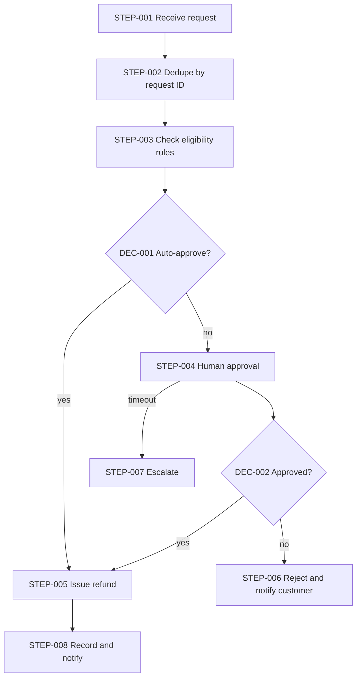

# Workflow Architecture: Customer refund approval

> Illustrative example (invented scenario) · Depth: **Standard** · Demonstrates: a high-risk, irreversible action; rules before AI; risk-based human approval with timeout and escalation; idempotency for the payment step.

## Business Objective

**BO-001** — Valid refund requests are paid quickly, risky ones are reviewed by a person, and no customer is ever refunded twice for the same request. `[STATED]`

## Requirements

| ID | Description | Source | Priority | Acceptance criteria |
|---|---|---|---|---|
| WR-001 | Refunds below a threshold that match policy are approved automatically | `[STATED]` | Must | Threshold and policy rules are configurable values, tested at the boundary |
| WR-002 | Refunds at or above the threshold, or failing any rule, require human approval | `[STATED]` | Must | No payment is issued for these without an approval record |
| WR-003 | A refund request produces at most one payment, even with duplicate events or retries | `[INFERRED]` | Must | Replay and timeout-retry tests produce one payment |
| WR-004 | If approval is not given in time, the request escalates and never auto-approves | `[RECOMMENDED]` | Must | Timeout test reaches escalation, not payment |
| WR-005 | Every decision records who or what decided, when, and on what basis | `[RECOMMENDED]` | Should | Audit entry exists for each outcome |

The threshold amount, policy rules and approval roles are `NOT PROVIDED`; they are configuration inputs, not decisions made in this document (Q-001, Q-002).

## Assumptions

| ID | Assumption | Impact if wrong |
|---|---|---|
| A-001 | The payment provider supports idempotency keys on refund creation `[ASSUMED]` | `REQUIRES VALIDATION`; otherwise the workflow must dedupe itself before calling it |
| A-002 | Refund eligibility can be decided mostly by rules (order status, window, amount) `[ASSUMED]` | If judgment on free-text reasons is needed, an AI-assist step could be added (not included here) |

## Trigger Architecture

Source: "refund requested" event from the order system. Payload: request ID, order ID, amount, reason code. Authentication: signed event. Validation: order exists, amount ≤ order total. Duplicate behavior: **request ID is the idempotency key** for the whole workflow. Volume: `UNKNOWN`. Failure behavior: unverifiable events rejected and logged.

## Workflow Architecture

Rung 1 throughout: eligibility is rule-based, so no model is used (see A-002). `RECOMMENDED`: do not add AI here unless free-text reason review becomes a stated need.

**DEC-001** — Auto-approve? Method: rules (eligible AND amount below threshold). Output: auto / needs approval. Fallback: needs approval.

**DEC-002** — Approved? Method: human decision (approve / reject / modify amount). Output: recorded decision with approver and reason.

| Step ID | Name | Type | Failure | Retry | Timeout |
|---|---|---|---|---|---|
| STEP-001 | Receive request | Trigger | Reject bad signature | N/A — sender retries | 10 s |
| STEP-002 | Dedupe by request ID | Database operation | Fail closed (no processing) if store unavailable | 3 attempts, backoff | 2 s |
| STEP-003 | Check eligibility rules | Function | Any error → needs approval (fail safe) | N/A (pure logic) | 2 s |
| STEP-004 | Human approval | Human approval | No decision → STEP-007 | Single reminder at half the window | 24 h `[ASSUMED]` |
| STEP-005 | Issue refund | API call (payment) | Unknown outcome → look up by idempotency key before any new attempt; never blind retry | Retry transient errors only, same key, backoff with jitter | 20 s |
| STEP-006 | Reject and notify customer | Notification | Queue for retry; decision already recorded | 5 attempts | 10 s |
| STEP-007 | Escalate | Notification | Alert operations channel if escalation cannot be sent | 3 attempts | 10 s |
| STEP-008 | Record and notify | Storage | Non-blocking buffer; alert if audit write fails | 5 attempts | 5 s |

## Error Handling

The dangerous case is STEP-005 timing out: the payment may or may not have happened. The workflow therefore checks the provider by idempotency key before any new attempt, and persists "refund_pending" state before calling so a crash cannot trigger a second payment (WR-003). Approval waiting is persisted state, not an open connection. Every rule-evaluation error resolves to "needs approval", never to "approve".

## Security

Approver identity comes from company sign-in; only listed roles can approve (roles are `NOT PROVIDED`, Q-002). The payment credential is held in a secret manager with refund-only scope; approvers never see it. Approval links are single-use and bound to the request ID. Customer data in notifications is minimal. Logs hold request and order IDs, not card data.

## Observability

Correlation ID = request ID. Metrics: auto-approved vs reviewed share, approval wait time, escalations, refund-call failures, duplicate-event count. Alerts: any refund in "pending" state longer than a set period (possible stuck payment), approval backlog age, audit-write failures.

## Risks

| ID | Risk | Likelihood | Severity | Mitigation |
|---|---|---|---|---|
| WRISK-001 | Double refund after timeout or replay | `UNKNOWN` | High | Idempotency key, persisted pending state, provider lookup (WR-003) |
| WRISK-002 | Threshold set too high lets abuse through automatically | `UNKNOWN` | High | Start conservative; review auto-approved sample; threshold is configuration |
| WRISK-003 | Approvals pile up and customers wait | Medium | Medium | Reminder, escalation, backlog alert |

## Implementation Blueprint

| Task | Component | Objective | Depends on | Acceptance criteria |
|---|---|---|---|---|
| TASK-001 | Intake and dedupe (STEP-001, STEP-002) | One workflow per request ID | — | Replay creates no second run (WR-003) |
| TASK-002 | Rule engine (STEP-003, DEC-001) | Configurable eligibility and threshold | TASK-001 | Boundary tests pass (WR-001) |
| TASK-003 | Approval flow (STEP-004, DEC-002, STEP-007) | Review UI/message, record decision, escalate | TASK-002 | No payment without approval record; timeout escalates (WR-002, WR-004) |
| TASK-004 | Refund execution (STEP-005) | Idempotent payment call with pending state | TASK-002 | Crash-and-retry test yields one payment (WR-003) |
| TASK-005 | Audit and notifications (STEP-006, STEP-008) | Decision record, customer message | TASK-003 | Audit entry per outcome (WR-005) |

## Open Questions

| ID | Question | Why it matters |
|---|---|---|
| Q-001 | What is the auto-approval threshold and what are the policy rules? | Core inputs to DEC-001 |
| Q-002 | Who may approve, and who is the escalation contact? | Defines STEP-004 and STEP-007 routing |
| Q-003 | Is partial refund allowed? | Changes the approval outcomes and payment call |
