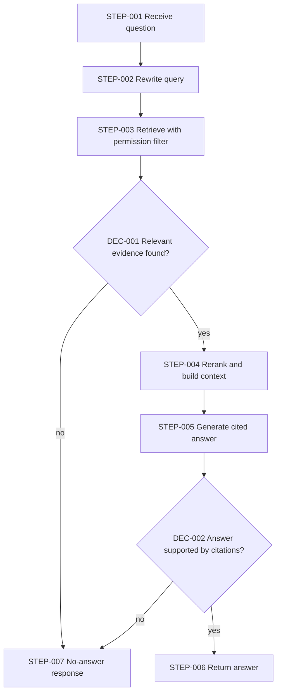

# Workflow Architecture: Internal policy Q&A

> Illustrative example (invented scenario) · Depth: **Standard** · Demonstrates: when retrieval is justified, permission-aware retrieval, an explicit "no answer" path, and evaluating retrieval separately from generation.

## Business Objective

**BO-001** — Employees get accurate, cited answers to HR and IT policy questions without waiting for a person, and are told plainly when the policies don't answer the question. `[STATED]`

## Requirements

| ID | Description | Source | Priority | Acceptance criteria |
|---|---|---|---|---|
| WR-001 | Answers are drawn from the current policy documents and cite the source section | `[STATED]` | Must | Every answer lists at least one citation that supports it |
| WR-002 | When retrieved material does not support an answer, the system says so and points to a contact | `[RECOMMENDED]` | Must | Out-of-scope test questions yield the no-answer response |
| WR-003 | A user only receives content from documents they are allowed to read | `[RECOMMENDED]` | Must | Restricted-document test set never surfaces for unauthorized users |
| WR-004 | Policy changes become searchable within a defined delay | `[INFERRED]` | Should | Delay target not defined (see Q-001) |
| WR-005 | Retrieval quality and answer quality are evaluated separately | `[RECOMMENDED]` | Should | Labeled question set with expected source sections |

**Why retrieval at all:** the policy set is expected to be too large to place in every prompt and changes over time `[ASSUMED]` (A-001). If the corpus were small and stable, putting it directly in the prompt (rung 2, no retrieval stack) would be simpler and should be chosen instead.

## Assumptions

| ID | Assumption | Impact if wrong |
|---|---|---|
| A-001 | Corpus is large enough and changes often enough that it cannot live in the prompt `[ASSUMED]` | If small and stable, drop the index and use full-context prompting |
| A-002 | Documents carry usable access-control metadata (group or role) `[ASSUMED]` | `REQUIRES VALIDATION`; without it WR-003 cannot be met and rollout should wait |

## Trigger Architecture

Source: user question from the chat interface. Authentication: the user's identity from the company sign-in; identity is passed to retrieval for permission filtering. Validation: length limit, text only. Volume: `UNKNOWN`. Duplicate behavior: questions are read-only, so repeats are harmless. Failure behavior: if the service is unavailable the interface says so and links to the policy library.

Separate indexing trigger: document-change events (or a scheduled sync) start re-indexing of changed documents.

## Workflow Architecture

**DEC-001** — Relevant evidence found? Method: retrieval score threshold tuned on the labeled set; below it the system does not call the generator. Output: proceed / no-answer.

**DEC-002** — Answer supported by citations? Method: deterministic check that each citation points to a retrieved passage, plus a check that the answer does not introduce figures absent from them. Output: return / no-answer.

| Step ID | Name | Type | Failure | Retry | Timeout |
|---|---|---|---|---|---|
| STEP-001 | Receive question | Trigger | Reject empty or oversized input | N/A | 5 s |
| STEP-002 | Rewrite query | AI call | On failure use the original question | 1 retry on transient error | 8 s |
| STEP-003 | Retrieve with permission filter | Retrieval | If search is down, return service-unavailable message | 2 retries, backoff with jitter | 5 s |
| STEP-004 | Rerank and build context | Function | Fall back to retrieval order | N/A (pure logic) | 3 s |
| STEP-005 | Generate cited answer | AI call | Invalid format → one repair retry, then no-answer | 1 repair retry; 2 on transient API error | 25 s |
| STEP-006 | Return answer | Action | Surface error to user | N/A | 5 s |
| STEP-007 | No-answer response | Action | Static text; cannot fail on model | N/A | 2 s |

Indexing pipeline (separate flow): fetch changed documents → extract text → split into passages with metadata (source, section, access groups, version) → embed or index → swap in. Failed documents are skipped and reported, not half-indexed; the previous version stays searchable until replacement succeeds. Whether a vector index is needed or keyword search suffices is decided from the labeled set (`REQUIRES VALIDATION`), not assumed.

## Error Handling

Degradation order: generation problem → no-answer (never an unsupported answer); retrieval problem → clear unavailable message; indexing problem → keep serving the last good index and alert. Read-only flow, so no idempotency concern on queries; indexing is idempotent by document version.

## Security

Permission filtering happens **inside retrieval**, using the asker's identity, before any text reaches the model (WR-003). Documents are treated as untrusted content: an instruction hidden in a document must not change behavior, so the generator has no tools and its output is limited to an answer with citations (indirect prompt injection). Per-user identities are not placed in logs beyond an ID. Model and index credentials in a secret manager.

## Observability

Correlation ID per question. Metrics: no-answer rate, retrieval hit rate on the labeled set, citation-validity rate, latency per step, token cost per answer, indexing lag, user feedback (helpful / not). Alerts: indexing failures, sudden rise in no-answer rate (index may be stale or broken).

## Risks

| ID | Risk | Likelihood | Severity | Mitigation |
|---|---|---|---|---|
| WRISK-001 | Stale or superseded policy cited | `UNKNOWN` | High | Version metadata; indexing lag alert; show document date in citations |
| WRISK-002 | Permission metadata missing or wrong, exposing restricted content | `UNKNOWN` | High | Fail closed on missing metadata; permission test set (WR-003) |
| WRISK-003 | Confident answer to an out-of-scope question | Medium | Medium | Evidence threshold (DEC-001), citation check (DEC-002) |

## Implementation Blueprint

| Task | Component | Objective | Depends on | Acceptance criteria |
|---|---|---|---|---|
| TASK-001 | Labeled question set | Expected source sections and out-of-scope cases | — | Covers WR-001, WR-002, WR-005 |
| TASK-002 | Indexing pipeline | Passages with access metadata, atomic swap | — | Failed doc does not corrupt index (WR-004) |
| TASK-003 | Retrieval with permission filter (STEP-003) | Identity-aware search | TASK-002 | Restricted docs never returned to unauthorized users (WR-003) |
| TASK-004 | Query rewrite, rerank, generation (STEP-002, STEP-004, STEP-005) | Cited answers | TASK-003 | Citation validity measured on TASK-001 set (WR-001) |
| TASK-005 | Evidence and citation gates (DEC-001, DEC-002, STEP-007) | No-answer path | TASK-004 | Out-of-scope questions get no-answer (WR-002) |
| TASK-006 | Metrics and alerts | Observability above | TASK-004 | Dashboard shows listed metrics |

## Open Questions

| ID | Question | Why it matters |
|---|---|---|
| Q-001 | How quickly must a policy change appear in answers? | Sets the indexing trigger design for WR-004 |
| Q-002 | Do all documents have owners and access groups today? | Gate for WR-003; may block launch |
| Q-003 | Expected questions per day? | Cost and capacity planning |
