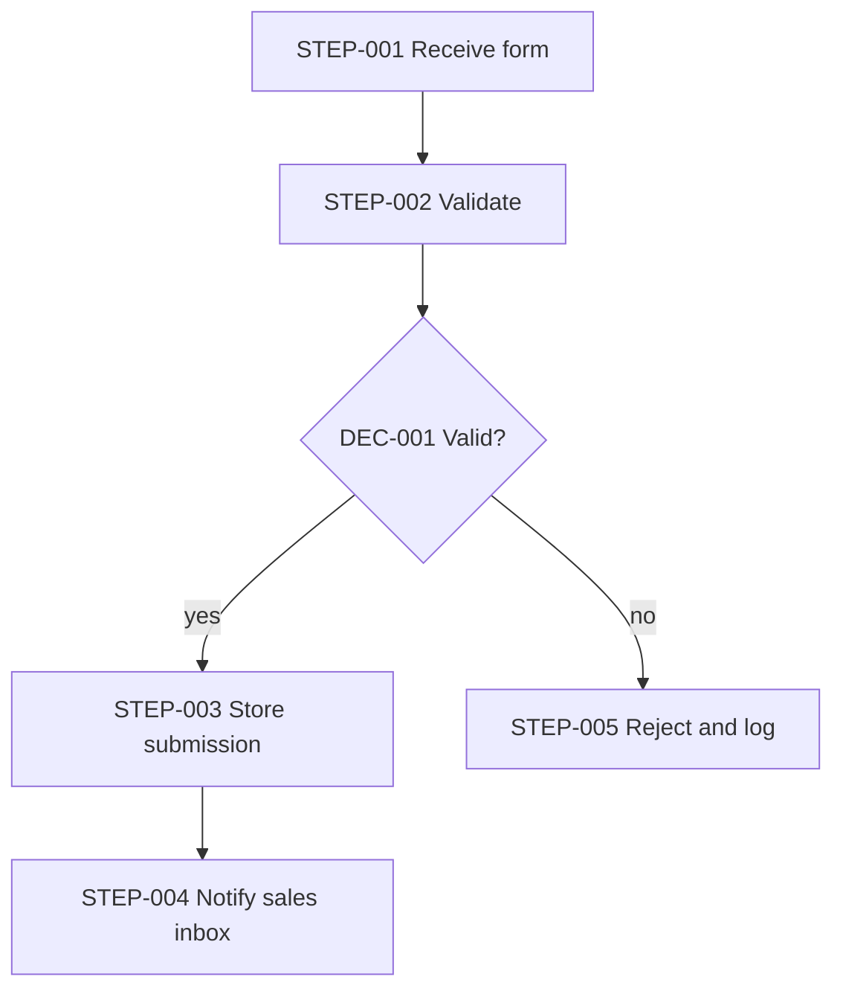

# Workflow Architecture: Contact-form intake

> Illustrative example (invented scenario) · Depth: **Quick** · Demonstrates: a workflow where the right answer is **no AI** — plain deterministic steps with real failure handling.

## Business Objective

**BO-001** — Every website contact-form submission reaches the sales inbox and is stored, so no enquiry is lost. `[STATED]`

Chosen on the complexity ladder: rung 1 (deterministic). Nothing here needs language understanding; an LLM or agent would add cost and variance for no requirement. `[RECOMMENDED]`

## Workflow Architecture

**DEC-001** — Valid? Method: rule (required fields present, email format, length limits). Output: valid / invalid. Fallback: invalid goes to rejection, never to storage.

| Step ID | Name | Type | Failure | Retry | Timeout |
|---|---|---|---|---|---|
| STEP-001 | Receive form (webhook) | Trigger | Reject unauthenticated or oversized requests with 4xx | N/A — sender retries | 10 s |
| STEP-002 | Validate fields | Validation | Invalid → STEP-005 | N/A (pure logic) | 1 s |
| STEP-003 | Store submission | Database operation | Park submission in a failure table and alert | 3 attempts, exponential backoff with jitter | 5 s per attempt |
| STEP-004 | Notify sales inbox | Notification (email) | Mark "notification pending" and retry later; submission is already safe | 5 attempts over 1 hour; deduplicate on submission ID so a retry never sends twice | 10 s |
| STEP-005 | Reject and log | Action | Log only; return a clear error to the form | N/A | 1 s |

## Error Handling

- Storage comes **before** notification: if email fails the enquiry still exists and can be re-sent; the reverse order could notify about data that was never saved.
- Duplicate form posts (user double-clicks, sender retries) are collapsed using a submission ID, so the store and the inbox each see one record.
- Anything that exhausts retries lands in the failure table, which a named person checks (see Open Questions).

## Assumptions

| ID | Assumption | Impact if wrong |
|---|---|---|
| A-001 | Volume is a few dozen submissions per day `[ASSUMED]` | Higher volume may call for queueing; design is otherwise unchanged |
| A-002 | The form provider can send an authenticated webhook `[ASSUMED]` | If not, STEP-001 becomes a poll of the form's API — `REQUIRES VALIDATION` |

## Open Questions

| ID | Question | Why it matters |
|---|---|---|
| Q-001 | Who owns the failure table and how fast must they react? | Determines alerting for STEP-003/STEP-004 exhausted retries |
| Q-002 | Does the form collect personal data subject to retention rules? | Would add retention and access requirements to STEP-003 |
