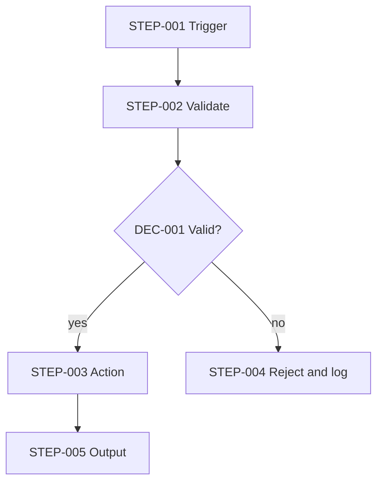

# Diagram methodology

Diagrams are for understanding, not decoration. Draw one when it clarifies something prose can't, and keep it consistent with the text.

## Which diagram
| Diagram | Use for |
|---|---|
| Workflow (flowchart) | Trigger → steps → decisions → outcomes, including failure branches |
| AI workflow | Where model calls, validation and fallback sit |
| Agent workflow | Goal → agent → tool → observation → decision loop, with stop conditions |
| Data flow | Where data enters, is transformed, stored, and leaves; mark sensitive data |
| Sequence | Interactions between user, workflow engine, AI, tools, APIs, database; good for timing and retries |

## Formats
Mermaid (default; renders in most Markdown viewers), PlantUML, ASCII, or structured definitions. Use Mermaid unless the user's environment calls for something else.

## Conventions
- Put the step's ID in the node label: `S3[STEP-003 Validate payload]`. This ties the picture to the step table and lets `scripts/validate_diagrams.py` verify the IDs exist.
- Every decision node (`{}`) has at least two labeled outgoing branches; show the failure/fallback branch, not only the happy path.
- Mark human steps and external systems distinctly (e.g. `subgraph` groups or consistent shapes).
- Keep it readable: under ~15 nodes per diagram; split by phase otherwise.
- Update diagrams whenever steps change; a stale diagram is worse than none.

## Template

